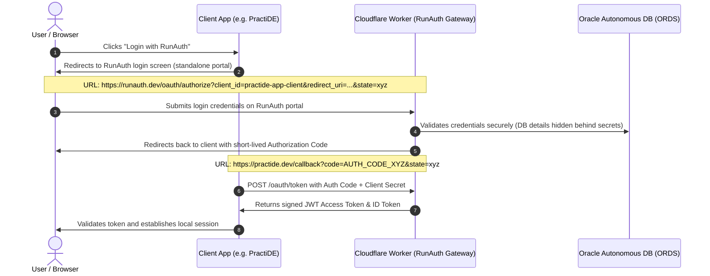

# RunAuth SSO (Single Sign-On) Provider Plan & Status

This repository contains the architecture, database schema, design specifications, and implementation status for **RunAuth**, a custom OAuth 2.0 and OpenID Connect (OIDC) identity provider.

---

## 1. Project Status Overview

- [x] **Oracle Autonomous Database Connection Setup**: Connected via ORDS REST API.
- [x] **Database Schema Execution**: Created `runauth_users`, `runauth_sessions`, and `runauth_apps` tables.
- [x] **Client Registration**: Initial client application `practide-app-client` registered in `runauth_apps`.
- [ ] **Cloudflare Worker Gateway**: Security proxy & API endpoints for ORDS (`/oauth/authorize`, `/oauth/token`, `/oauth/userinfo`).
- [ ] **RunAuth Web Portal**: Standalone login/register UI hosted on Cloudflare Pages (Google-style redirect login).

---

## 2. Architecture & Security Layer

RunAuth operates as a standalone identity provider using a 3-tier architecture:



### Security & Gateway Highlights (Cloudflare Worker)
1. **DB Credential Shielding**: Oracle DB credentials and ORDS endpoints are stored in Worker environment secrets and never exposed to clients.
2. **Whitelisted Endpoints**: Clients only communicate with defined REST routes (`/oauth/authorize`, `/oauth/token`, `/oauth/userinfo`).
3. **Edge Caching & KV**: Active sessions and public JWKS verification keys are cached on Cloudflare Edge for sub-millisecond validation.
4. **Rate Limiting**: Protects login and registration routes against brute-force attacks.

---

## 3. Database Schema (Executed & Live)

The following tables have been successfully created on the Oracle Autonomous Database:

```sql
CREATE TABLE runauth_users (
    id VARCHAR2(255) PRIMARY KEY,
    email VARCHAR2(255) UNIQUE NOT NULL,
    password_hash VARCHAR2(255) NOT NULL,
    created_at TIMESTAMP DEFAULT CURRENT_TIMESTAMP
);

CREATE TABLE runauth_sessions (
    id VARCHAR2(255) PRIMARY KEY,
    user_id VARCHAR2(255) NOT NULL,
    expires_at TIMESTAMP NOT NULL,
    created_at TIMESTAMP DEFAULT CURRENT_TIMESTAMP,
    CONSTRAINT fk_user_session FOREIGN KEY (user_id) REFERENCES runauth_users(id) ON DELETE CASCADE
);

CREATE TABLE runauth_apps (
    client_id VARCHAR2(255) PRIMARY KEY,
    client_secret VARCHAR2(255) NOT NULL,
    app_name VARCHAR2(100) NOT NULL,
    redirect_uri VARCHAR2(500) NOT NULL,
    created_at TIMESTAMP DEFAULT CURRENT_TIMESTAMP
);
```

### Pre-registered Applications:
- **Client ID**: `practide-app-client`
- **App Name**: `PractiDE`
- **Redirect URI**: `http://localhost:3000/api/auth/callback`

---

## 4. API Specification

### A. GET `/oauth/authorize`
- **Purpose**: Serves the standalone login page or processes authorization.
- **Parameters**: `client_id`, `redirect_uri`, `response_type=code`, `state`, `scope`.

### B. POST `/oauth/token`
- **Purpose**: Exchanges Authorization Code for Access & ID tokens.
- **Body**: `grant_type`, `code`, `client_id`, `client_secret`, `redirect_uri`.
- **Response**: JWT Access Token & ID Token.

### C. GET `/oauth/userinfo`
- **Purpose**: Returns profile information of authenticated user.
- **Headers**: `Authorization: Bearer <access_token>`

---

## 5. Next Implementation Steps

1. Create `wrangler.toml` and Cloudflare Worker codebase in `RunAuth` for OIDC endpoints.
2. Build the high-aesthetic, standalone login UI on Cloudflare Pages.
3. Integrate PractiDE with the live RunAuth provider.
